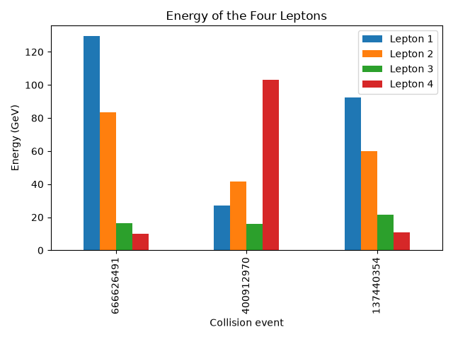
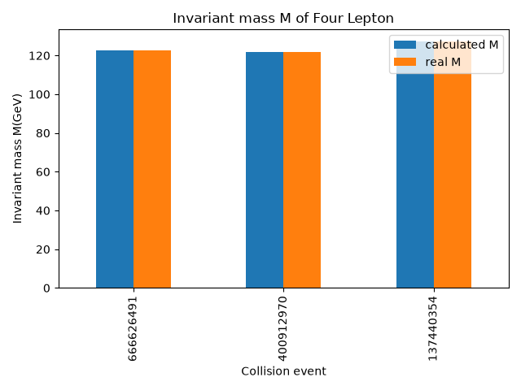

# Higgs → Four Leptons

An exploratory analysis of CMS Higgs candidate events that decay to four leptons.

## About

This project looks at **3 real CMS collision events** from 2011 where a Higgs boson candidate decays into four leptons (H → 4l).

1. Load the event data
2. Explore lepton energies, charges, and momenta
3. Recalculate the four-lepton invariant mass
4. Compare the calculated mass with the mass provided in the dataset

## Dataset

The data comes from the [CERN Open Data Portal](https://opendata.cern.ch/record/5210):

**Higgs to four leptons from 2011** (CMS, education & outreach release)

- Recorded in 2011, published in 2019  
- 3 Higgs candidate events with invariant mass between **120–130 GeV**  
- Released by CMS for education and outreach (not for a full physics analysis)  
- Local file: `data/raw/higgs_4lepton.csv`

Each event includes lepton energy (`E`), momentum (`px`, `py`, `pz`), transverse momentum (`pt`), angles (`eta`, `phi`), charge (`Q`), and the four-lepton invariant mass (`M`).

## Analysis

In `src/analysis.py` :

- Explored the dataset shape, columns, and lepton charges  
- Compared the energy of the four leptons in each event

Checked transverse momentum using 

```python
     pt = √px1² + py1²
```

- Recalculated the invariant mass from total four-lepton energy and momentum:

```python
     M=√E² - px² - px² - pz²
```

- Compared my calculated mass (`cal_M`) with the official mass column (`M`)

## Results

### Energy of the Four Leptons



*Fig 1.1 — Energy of the four leptons.*

### Calculated vs Dataset Invariant Mass



*Fig 1.2 — Comparison of independently calculated invariant mass with the dataset values.*

- Each event has **four leptons** with mixed charges, consistent with a four-lepton final state.  
- Lepton energies vary a lot within and across events.  
- The recalculated invariant masses match the dataset values closely:


| Event     | Calculated M (GeV) | Dataset M (GeV) |
| --------- | ------------------ | --------------- |
| 666626491 | 122.67             | 122.67          |
| 400912970 | 121.89             | 121.89          |
| 137440354 | 127.05             | 127.05          |


All three candidates fall in the **~122–127 GeV** range, near the known Higgs mass (~125 GeV).

## Getting Started

### Requirements

- Python **3.11+**
- [uv](https://github.com/astral-sh/uv)

### Setup

```bash
uv sync
```

### Run the analysis

From the project root:

```bash
uv run python src/analysis.py
```

This will:

1. Print exploration output to the terminal
2. Show the plots
3. Save figures to:

```text
results/
└── figures/
    ├── lepton_energy.png
    └── lepton_invariant_mass.png
```

### Project layout

```text
higgs/
├── data/raw/higgs_4lepton.csv
├── notebooks/
├── results/figures/
├── src/analysis.py
├── pyproject.toml
└── README.md
```

